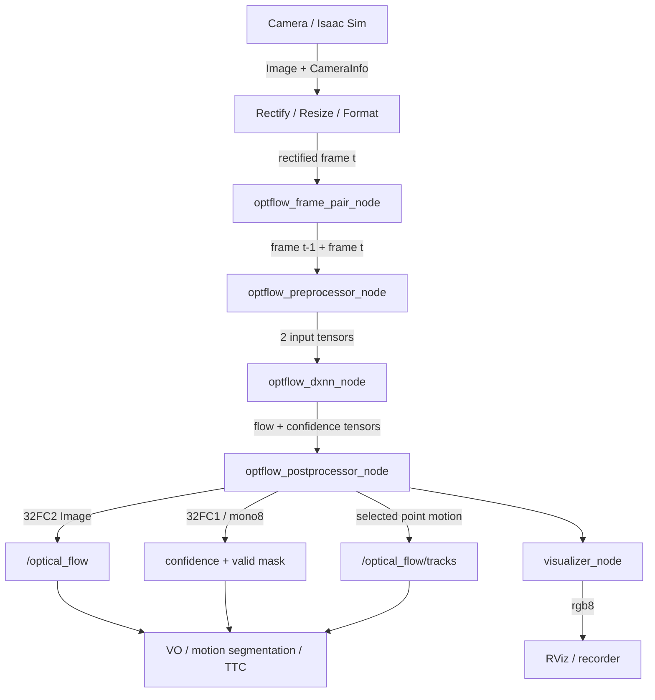
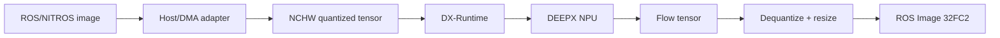
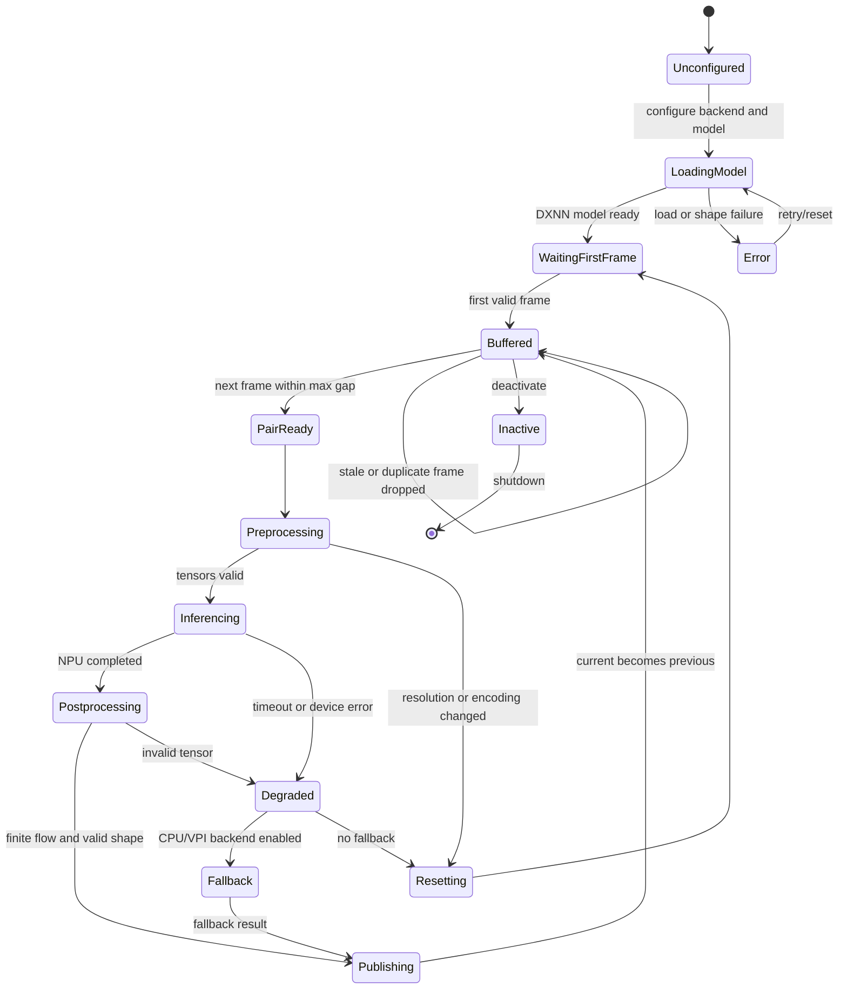

# DX-NEWTON-OptFlow

DEEPX NPU가 장착된 ROS 2 시스템에서 연속된 두 영상 프레임 사이의 픽셀 이동을 추정하는 **Optical Flow 라이브러리 구성 초안**이다. Isaac ROS의 영상 전처리·NITROS 그래프와 연결하고, 학습 기반 optical-flow 모델의 추론을 DXNN/DX-Runtime으로 DEEPX NPU에서 실행하는 것을 목표로 한다.

> **현재 상태:** 아래 내용은 구현 대상 아키텍처와 ROS 인터페이스 정의이다. 

## 1. 기능 정의

두 프레임 \(I_{t-1}\), \(I_t\)가 주어졌을 때 각 픽셀 \((x,y)\)의 2차원 이동을 추정한다.

$$
\mathbf{F}_t(x,y)=[u_t(x,y),v_t(x,y)]
$$

$$
I_t(x+u_t,y+v_t)\approx I_{t-1}(x,y)
$$

핵심 기능:

- timestamp 순서에 따른 2-frame pairing과 frame-gap 검사
- mono/RGB 입력, resize, normalization, tensor packing
- DEEPX NPU에서 sparse 또는 dense optical-flow model 추론
- 원본 해상도로 flow vector rescale
- confidence/validity/occlusion mask 생성
- `32FC2` flow image와 시각화 영상 발행
- feature tracking, VO, motion segmentation, TTC 등 downstream 연결
- NPU timeout, frame drop, resolution change에 대한 reset/fallback
- EPE, angular error, FPS, end-to-end latency 및 전력 측정

## 2. 기존 Isaac ROS (DX_Newton)에서 무엇을 기반으로 하는가

다음 구성요소를 조합한다.

| 기반 패키지/기술 | 재사용/참조할 부분 | DX-NEWTON-OptFlow에서의 역할 |
|---|---|---|
| [`isaac_ros_image_pipeline`](https://nvidia-isaac-ros.github.io/repositories_and_packages/isaac_ros_image_pipeline/index.html) | RectifyNode, ResizeNode, ImageFormatConverterNode | rectification, resize, color conversion |
| [`isaac_ros_nitros`](https://nvidia-isaac-ros.github.io/repositories_and_packages/isaac_ros_nitros/index.html) | NitrosImage/NitrosTensorList, type negotiation | Isaac ROS 영상 그래프 연결 |
| [`isaac_ros_visual_slam`](https://nvidia-isaac-ros.github.io/repositories_and_packages/isaac_ros_visual_slam/index.html) | consecutive-frame feature tracking과 VO 사용 방식, downstream odometry 계약 | optical flow의 활용·비교 기준 |
| [NVIDIA VPI Pyramidal LK](https://docs.nvidia.com/vpi/4.1.3/algo_optflow_lk.html) | 이전/현재 pyramid와 keypoint로 sparse 2D 이동·status 출력 | 고전 optical-flow baseline |
| [DEEPX DX-AllSuite/DXNN](https://github.com/DEEPX-AI/dx-all-suite) | ONNX compile, INT8 quantization, `.dxnn`, DX-Runtime | learned optical-flow NPU backend |
| ROS 2 `image_transport`, `sensor_msgs` | 표준 영상 전송·encoding | 비-NITROS 소비자와 호환 |

### 권장 비교 backend

- `CPU_LK`: OpenCV pyramidal Lucas–Kanade
- `VPI_LK`: NVIDIA VPI sparse LK(CUDA 지원 환경의 비교군)
- `DXNN_DENSE`: DEEPX NPU learned dense flow
- `DXNN_SPARSE`: DEEPX NPU learned keypoint/descriptor + CPU matching 또는 learned sparse flow

DEEPX NPU의 핵심 대상은 `DXNN_DENSE` 또는 학습 기반 front-end이다. OpenCV/VPI는 정확도·지연 fallback과 baseline으로 둔다.

## 3. NPU 모델 요구사항

권장 model I/O 계약:

```text
Input
  image_prev: [1, 3, H, W]
  image_curr: [1, 3, H, W]
  또는 concatenated_images: [1, 6, H, W]

Output
  flow:       [1, 2, H', W']
  confidence: [1, 1, H', W']  (optional)
  occlusion:  [1, 1, H', W']  (optional)
```

모델 후보는 RAFT-Small, PWC-Net 계열, FastFlowNet류의 경량 모델이지만, 특정 모델이 DXNN에서 지원된다고 선결론 내리면 안 된다. 다음을 먼저 통과해야 한다.

1. ONNX export의 static/dynamic shape 정책 확인
2. DX-Compiler operator support 확인
3. correlation, grid-sample/warp, iterative update 연산의 compile 가능 여부 확인
4. INT8 calibration dataset 구축
5. FP32 ONNX 대비 EPE와 outlier degradation 검증
6. target resolution에서 latency와 memory 측정

지원되지 않는 연산은 network 구조 변경, host post-processing 또는 대체 모델로 해결한다.

## 4. 중요한 메모리 설계

NITROS (zero-copy) 에 기반하여 설계.

### 1차 구현

```text
NitrosImage or sensor_msgs/Image
  -> CPU-accessible contiguous buffer
  -> layout/color/quantization
  -> DX-Runtime input buffer
  -> DEEPX NPU
```

### 최적화 구현

DX-Runtime과 플랫폼 드라이버가 DMA-BUF 또는 외부 buffer import를 공식 지원하는 경우에만 copy reduction을 적용한다. “NITROS zero-copy”라는 이유만으로 CUDA pointer를 NPU에 직접 넘겨서는 안 된다.

## 5. 패키지 구성 초안

```text
dx_newton_optflow/
├── dx_newton_optflow_core/          # pairing, scaling, post-process
├── dx_newton_optflow_ros/           # ROS 2 components and launch
├── dx_newton_optflow_interfaces/    # tracks/status messages
├── dx_newton_optflow_dxnn/          # DX-Runtime backend
├── dx_newton_optflow_baselines/     # OpenCV/VPI adapters
├── models/                          # model metadata, not proprietary binaries
├── config/
├── launch/
└── test/
```

## 6. 노드 구성 초안

| 노드 | 실행 장치 | 기능 |
|---|---|---|
| `optflow_frame_pair_node` | CPU | (t-1,t) frame cache, timestamp/sequence 검증 |
| `optflow_preprocessor_node` | CPU 또는 기존 Isaac ROS node | rectify, resize, RGB conversion, normalize, tensor pack |
| `optflow_dxnn_node` | DEEPX NPU | `.dxnn` 모델 로드, async inference, output tensor 반환 |
| `optflow_postprocessor_node` | CPU | flow upsample, vector scale 복원, validity/confidence 처리 |
| `optflow_visualizer_node` | CPU | HSV/color-wheel flow 영상과 vector overlay |
| `optflow_tracker_adapter_node` | CPU | dense flow에서 selected track array 생성 |
| `optflow_health_monitor_node` | CPU | latency, frame gap, NPU timeout, invalid ratio 진단 |
| `RectifyNode`/`ResizeNode`/`ImageFormatConverterNode` | Isaac ROS | upstream 전처리 |
| `VisualSlamNode` 또는 custom VO | Isaac ROS/downstream | flow/tracks를 odometry 또는 검증에 활용 |

초기 구현에서는 frame pair와 NPU inference를 하나의 composable node에 넣을 수 있지만, 인터페이스와 측정 지점을 명확히 하기 위해 논리적으로는 위와 같이 분리한다.

## 7. ROS 메시지 계약

### 입력

| Topic | Message | 설명 |
|---|---|---|
| `/camera/image_rect` | `sensor_msgs/Image` 또는 `NitrosImage` | 보정된 현재 프레임 |
| `/camera/camera_info` | `sensor_msgs/CameraInfo` 또는 `NitrosCameraInfo` | 해상도·intrinsic·frame |
| `/optflow/reset` | service | frame history 초기화 |
| `/roi_mask` | `sensor_msgs/Image`(선택) | 평가 또는 추론 대상 영역 |

### 출력

| Topic | Message/Encoding | 설명 |
|---|---|---|
| `/optical_flow` | `sensor_msgs/Image`, `32FC2` | 픽셀별 ((u,v)), 단위 pixel/frame |
| `/optical_flow/confidence` | `sensor_msgs/Image`, `32FC1` | 0–1 confidence |
| `/optical_flow/valid_mask` | `sensor_msgs/Image`, `mono8` | valid/occluded/invalid mask |
| `/optical_flow/visualization` | `sensor_msgs/Image`, `rgb8` | color-wheel flow |
| `/optical_flow/tracks` | custom `TrackedPointArray` | ID, previous/current point, confidence, status |
| `/optical_flow/status` | `diagnostic_msgs/DiagnosticArray` | backend, FPS, latency, drops, NPU status |

### `TrackedPointArray` 개념 필드

```text
std_msgs/Header header
builtin_interfaces/Time previous_stamp
TrackedPoint[] tracks

TrackedPoint:
  uint32 id
  geometry_msgs/Point32 previous
  geometry_msgs/Point32 current
  float32 confidence
  uint8 status
```

두 영상의 timestamp가 모두 필요하므로 output header에는 현재 프레임 timestamp를 두고 `previous_stamp`를 별도 보존한다.

## 8. 메시지와 노드 흐름



### 메모리·실행 경로



## 9. 상태 다이어그램



## 10. 핵심 처리 규칙

### 해상도 복원

모델 입력이 \(W_m \times H_m\), 원본이 \(W_o \times H_o\)이면 upsample 후 vector 크기도 보정한다.

$$
u_o=u_m\frac{W_o}{W_m},\qquad
v_o=v_m\frac{H_o}{H_m}
$$

flow map만 resize하고 \(u,v\) 크기를 보정하지 않으면 이동량이 잘못된다.

### Frame gap

- (Delta t leq Delta t_{max})인 pair만 추론
- output은 기본적으로 pixel/frame
- pixel/second가 필요하면 \((u/\Delta t,v/\Delta t)\)를 별도 topic 또는 parameter로 명확히 구분
- timestamp 역전, duplicate, 큰 gap이면 history reset

### Backpressure

- queue depth는 1 또는 2로 제한
- 처리 중 새 프레임이 누적되면 `latest-only` 정책을 기본값으로 고려
- 입력/출력 timestamp, dropped count, queue wait를 모두 기록
- latency를 낮추기 위해 오래된 pair를 순차 처리하지 않음

## 11. 후속 노드 활용

| 소비자 | 입력 | 활용 |
|---|---|---|
| Visual odometry | tracks/flow + CameraInfo | frame-to-frame motion estimation |
| Dynamic-object mask | flow + ego-motion | 독립 이동 객체 분리 |
| TTC estimator | flow + CameraInfo | 접근 물체 time-to-collision |
| Video stabilization | flow/tracks | global motion estimation |
| Visual SLAM evaluator | flow/tracks vs cuVSLAM observations | feature tracking 비교 |
| Robot controller | aggregated flow | reactive avoidance 또는 visual servoing |

Isaac ROS Visual SLAM은 자체 feature tracking을 사용하므로, 이 optical flow를 내부에 바로 주입할 수 있다고 가정해서는 안 된다. 첫 단계에서는 별도 downstream VO 노드 또는 비교/진단 입력으로 사용하고, cuVSLAM이 공식 external-flow interface를 제공하는 경우에만 직접 통합한다.

## 12. 성능평가

| 평가축 | 권장 지표 |
|---|---|
| Flow 정확도 | EPE, angular error, Fl-all/outlier rate |
| 추적 정확도 | track survival rate, endpoint drift, valid ratio |
| 실시간성 | FPS, inference latency, E2E median/P95/P99 |
| 시간 안정성 | jitter, dropped pair rate, queue wait |
| NPU 효율 | NPU utilization, memory, power, FPS/W |
| 양자화 영향 | FP32 ONNX vs INT8 DXNN EPE 차이 |
| 강건성 | 밝기, blur, textureless region, large displacement, occlusion |
| downstream | VO ATE/RPE, TTC error, motion-mask IoU |

### 권장 dataset

- Sintel: large motion, blur, atmospheric effects
- KITTI Flow: driving scene
- FlyingChairs/FlyingThings3D: training·sanity check
- 자체 Isaac Sim ground-truth flow dataset
- 실제 카메라 rosbag: end-to-end latency·전력·강건성

### 필수 비교군

1. OpenCV pyramidal LK
2. NVIDIA VPI pyramidal LK(지원 환경)
3. FP32 ONNX Runtime
4. INT8 DEEPX DXNN
5. 필요 시 기존 GPU optical-flow baseline

정확도 비교는 같은 resize, crop, frame pair, valid mask를 사용해야 하며 sparse LK와 dense flow는 공통 valid points 또는 downstream metric으로 비교한다.

## 13. 구현 순서

1. ROS frame-pair buffer와 timestamp/reset 정책
2. `32FC2` flow message 및 visualizer
3. OpenCV LK baseline
4. ONNX Runtime learned model baseline
5. DX-Compiler operator compatibility와 static input shape 확정
6. quantization dataset 및 ONNX → INT8 `.dxnn`
7. DX-Runtime async inference node
8. flow rescale·confidence·occlusion post-processing
9. NITROS/ROS adapter 및 copy profiling
10. accuracy–latency–power benchmark와 downstream VO 평가

## 참고 자료

- [NVIDIA Isaac ROS Image Pipeline](https://nvidia-isaac-ros.github.io/repositories_and_packages/isaac_ros_image_pipeline/index.html)
- [NVIDIA Isaac ROS NITROS](https://nvidia-isaac-ros.github.io/repositories_and_packages/isaac_ros_nitros/index.html)
- [NVIDIA Isaac ROS Visual SLAM](https://nvidia-isaac-ros.github.io/repositories_and_packages/isaac_ros_visual_slam/index.html)
- [NVIDIA VPI Pyramidal LK Optical Flow](https://docs.nvidia.com/vpi/4.1.3/algo_optflow_lk.html)
- [DEEPX DX-AllSuite/DXNN](https://github.com/DEEPX-AI/dx-all-suite)
